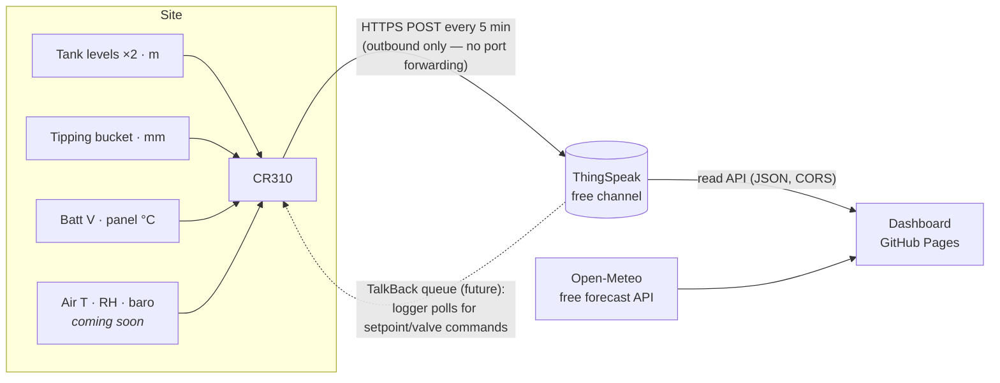

# 🏡 Home — sensors, dashboard & (eventually) automation

**Live dashboard: <https://cdomotor-g.github.io/home/>**

A zero-cost smart-home monitoring stack around a Campbell Scientific **CR310**
datalogger: the logger pushes readings to **ThingSpeak** over plain HTTPS POST
(no port forwarding, no extra hardware), and a static dashboard on **GitHub
Pages** reads them back, pulls **Open-Meteo** forecasts, and overlays
*prediction vs actual* on one chart. Collections, sensors, controls and
setpoints are all managed from a CRUD built into the dashboard.

> The dashboard boots in **demo mode** with generated data until a ThingSpeak
> channel is configured in **Settings**, so you can explore everything right away.

## How it fits together

Everything is outbound from the logger and browser-side in the dashboard —
there is no server to run, and every piece is free.

## Data storage: why ThingSpeak

| Option | Cost | Fit |
|---|---|---|
| **ThingSpeak** (recommended) | Free (non-commercial): ~3 M messages/yr, 4 channels, 8 fields each | CR310 `HTTPPost` works out of the box; browser-readable JSON API with CORS; **TalkBack** command queue gives a no-port-forwarding path to *controls* later |
| Google Sheets + Apps Script webhook | Free | Works, but Apps Script redirects trip up logger HTTP clients, and querying/aggregating from the browser is clunkier |
| InfluxDB Cloud free tier | Free | Nice queries, but **30-day retention** kills long-term tank/rain history |
| Commit CSVs to this repo via API | Free | Needs a GitHub token embedded in the logger program; API is awkward from CRBasic |

A 5-minute upload interval is ~105 k messages/year — about 3 % of the free
allowance, with room for the future subsystem channels (mushrooms, hydroponics,
garden) on the same account.

### Channel field map

One channel, one field per measurement:

| Field | Measurement | Unit |
|---|---|---|
| 1 | Tank 1 level | m |
| 2 | Tank 2 level | m |
| 3 | Rain (total over upload interval) | mm |
| 4 | Logger battery | V |
| 5 | Panel temperature | °C |
| 6 | Air temperature *(soon)* | °C |
| 7 | Barometric pressure *(soon)* | hPa |
| 8 | Relative humidity *(soon)* | % |

The dashboard's default sensor config matches this map exactly — remap any of
it in **Manage** if you wire things differently.

## Getting live data flowing

1. **Create a ThingSpeak channel** (free account at thingspeak.com) with the
   8 fields above. Note the **Channel ID**, **Write API key** and (if you keep
   the channel private) the **Read API key**.
2. **Program the CR310** — adapt [`logger/CR310_ThingSpeak.CR300`](logger/CR310_ThingSpeak.CR300):
   drop in your Write key, keep your existing measurement code, and it posts
   every 5 minutes with `HTTPPost`. Rain is accumulated between posts so daily
   totals reconstruct exactly.
3. **Open the [dashboard](https://cdomotor-g.github.io/home/) → Settings** and
   enter the Channel ID + Read key, plus your latitude/longitude for forecasts.
4. Done — the demo badge disappears and you're looking at your own data.

## The dashboard

- **Stat tiles** — latest reading per sensor with 24 h delta, a sparkline, and
  low/high alert thresholds (battery warns below 11.5 V out of the box).
- **Charts** — time-series per collection (sensors sharing a unit share an
  axis; nothing ever gets a second y-axis), rain as hourly/daily/weekly total
  bars, with crosshair tooltips, a table view on every chart, and
  24 h / 7 d / 30 d / 90 d ranges.
- **Forecast vs actual** — for any sensor mapped to an Open-Meteo variable
  (temperature, humidity, pressure, precipitation), measured data is drawn
  solid and the forecast dashed on the *same* chart, spanning the past 3 days
  and next 4, so you can see how the prediction tracked reality. Rain compares
  daily totals side-by-side.
- **Manage (CRUD)** — collections for areas/systems around the place (water,
  weather, mushroom house, hydroponics…), each holding **sensors** (name, unit,
  type, ThingSpeak field, alert range, forecast mapping, optional per-sensor
  channel override for future subsystems) and **controls** (heater / cooler /
  fan / valve / humidifier / pump, linked sensor, auto/manual mode,
  **setpoint + deadband**, on-below or on-above behaviour).
- **Light & dark theme**, phone-friendly, no build step, no dependencies.

Dashboard configuration lives in the browser's localStorage; **Settings →
Export config** produces a JSON backup you can import on another device (or
commit here as your source of truth).

## Controls & automation roadmap

Controls created in the CRUD are configuration-first: the dashboard already
evaluates each one against live readings and shows what it *would* do
(ON / OFF / in deadband). Closing the loop, still with no port forwarding:

1. Wire relays/valves to the CR310 (SW12 / control ports).
2. Dashboard pushes setpoint changes and manual commands to the channel's
   **ThingSpeak TalkBack** queue (a simple HTTPS POST from the browser).
3. The logger's slow sequence polls TalkBack each cycle (`HTTPGet`), applies
   commands (open valve, new heater setpoint…), and reports state back on a
   status field.

Simple threshold automation (heater on below 18 °C ± 0.5) is best run *on the
logger* so it keeps working when the internet doesn't; the dashboard is where
you edit the numbers.

## Repo contents

| Path | What |
|---|---|
| [`index.html`](index.html) | The whole dashboard — a single self-contained file served by GitHub Pages |
| [`logger/CR310_ThingSpeak.CR300`](logger/CR310_ThingSpeak.CR300) | CRBasic template: measurements + rain accumulation + `HTTPPost` to ThingSpeak |

*Dashboard URL note: served by GitHub Pages from the default branch — if Pages
is set to “Deploy from a branch”, it goes live once this lands on `main`.*
