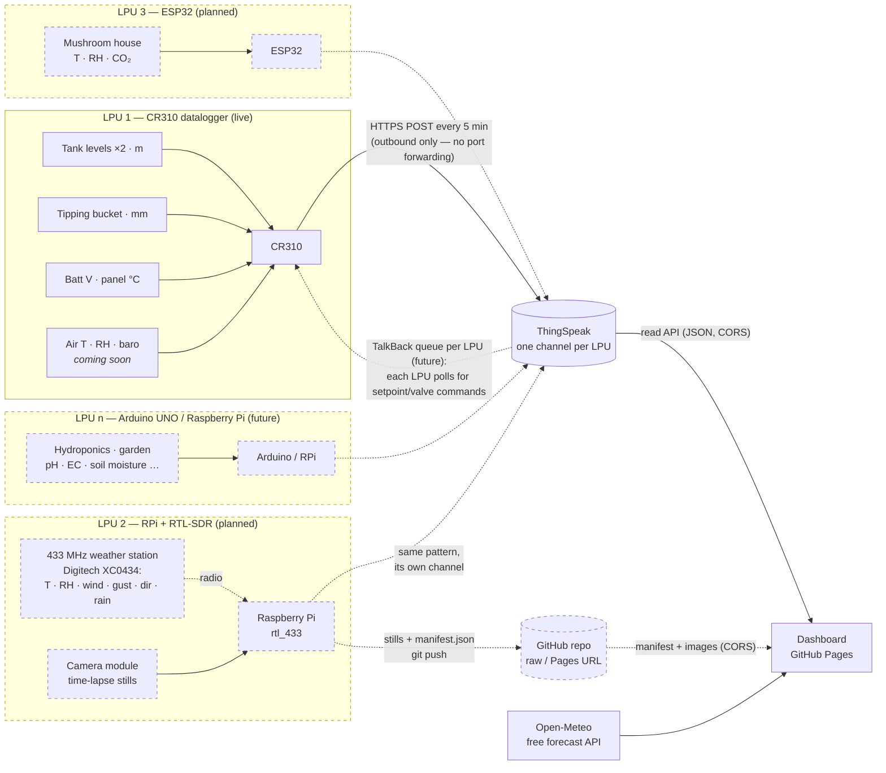

# 🏡 Home — sensors, dashboard & (eventually) automation

**Live dashboard: <https://cdomotor-g.github.io/home/>**

A zero-cost smart-home monitoring stack built around **LPUs — Local
Processing Units**: field devices that each carry a cluster of sensors and
push readings to **ThingSpeak** over plain HTTPS POST (no port forwarding, no
extra hardware). The first LPU is a Campbell Scientific **CR310** datalogger;
the architecture leaves room for more (ESP32, Arduino UNO, Raspberry Pi…),
each on its own ThingSpeak channel. A static dashboard on **GitHub Pages**
reads everything back, pulls **Open-Meteo** forecasts, and overlays
*prediction vs actual* on one chart. Camera LPUs publish **time-lapse stills**
to a git repo and the dashboard shows them per collection. Collections,
sensors, controls and setpoints are all managed from a CRUD built into the
dashboard — each collection can carry a custom **icon image** (uploaded or
pasted) and a camera feed.

> The dashboard boots in **demo mode** with generated data — including a
> simulated RPi + RTL-SDR weather-station LPU (wind, gusts, outdoor T/RH, a
> placeholder camera still) and a simulated ESP32 LPU running a mushroom
> house — until a ThingSpeak channel is configured in **Settings**, so you can
> explore everything right away.

## How it fits together

One LPU is live today; the same pattern repeats for every LPU that joins
(dashed = planned):



Everything is outbound from each LPU and browser-side in the dashboard —
there is no server to run, and every piece is free.

## LPUs — Local Processing Units

An LPU is any device in the field that can take measurements and make an
outbound HTTPS POST. Each LPU carries **multiple sensors** (and eventually
relays), owns **one ThingSpeak channel** (up to 8 fields), and runs its own
local logic so it keeps working when the internet doesn't.

| LPU | Status | Carries |
|---|---|---|
| **CR310 datalogger** | ✅ live | Tank levels ×2, rain gauge, battery & panel temp — air T / RH / baro soon |
| Raspberry Pi + RTL-SDR + camera | 🔜 planned | Receives the 433 MHz consumer weather station (Digitech XC0434: T, RH, wind, gust, direction, rain) via rtl_433, and publishes time-lapse camera stills |
| ESP32 | 🔜 planned | Mushroom house: temperature, humidity, CO₂ — plus heat-mat / humidifier relays |
| Arduino UNO (+ WiFi/Ethernet shield) | 💡 candidate | Hydroponics: pH, EC, water temperature, pump control |
| Raspberry Pi | 💡 candidate | Garden: soil-moisture array, anything needing more compute |

Adding an LPU never touches the dashboard's code: create a new ThingSpeak
channel, point the device's firmware at it, then add its sensors in
**Manage** with the per-sensor *channel override* set to the new channel.

## Data storage: why ThingSpeak

| Option | Cost | Fit |
|---|---|---|
| **ThingSpeak** (recommended) | Free (non-commercial): ~3 M messages/yr, 4 channels, 8 fields each | One channel per LPU; CR310 `HTTPPost` works out of the box and every candidate LPU (ESP32 / Arduino / Pi) has an HTTPS client; browser-readable JSON API with CORS; **TalkBack** command queue gives a no-port-forwarding path to *controls* later |
| Google Sheets + Apps Script webhook | Free | Works, but Apps Script redirects trip up logger HTTP clients, and querying/aggregating from the browser is clunkier |
| InfluxDB Cloud free tier | Free | Nice queries, but **30-day retention** kills long-term tank/rain history |
| Commit CSVs to this repo via API | Free | Needs a GitHub token embedded in the logger program; API is awkward from CRBasic |

A 5-minute upload interval is ~105 k messages/year **per LPU** — about 3 % of
the free allowance each, so the four free channels comfortably host four LPUs
(mushrooms, hydroponics, garden…) on the same account.

### Channel field map — LPU 1 (CR310)

One channel per LPU, one field per measurement. The CR310's channel:

| Field | Measurement | Unit |
|---|---|---|
| 1 | Tank 1 level | m |
| 2 | Tank 2 level | m |
| 3 | Rain (total over upload interval) | mm |
| 4 | Logger battery | V |
| 5 | Panel temperature | °C |
| 6 | Air temperature *(soon)* | °C |
| 7 | Barometric pressure *(soon)* | hPa |
| 8 | Relative humidity *(soon)* | % |

The dashboard's default sensor config matches this map exactly — remap any of
it in **Manage** if you wire things differently. Each subsequent LPU gets its
own channel and field map (e.g. the planned ESP32: field 1 grow-room
temperature, field 2 humidity, field 3 CO₂).

### Channel field map — weather-station LPU (RPi + RTL-SDR)

| Field | Measurement | Aggregation per upload |
|---|---|---|
| 1 | Outdoor temperature (°C) | last reading |
| 2 | Outdoor humidity (%) | last reading |
| 3 | Wind speed (m/s) | mean |
| 4 | Wind gust (m/s) | max |
| 5 | Wind direction (°) | last reading |
| 6 | Rain over the interval (mm) | delta of the station's cumulative counter |
| 7 | Sensor battery OK (1/0) | last reading |
| 8 | Packets decoded | count — a cheap RF-link health metric |

The dashboard's default **Backyard station** collection maps fields 1–5 out of
the box (with demo data until the Pi is online); add field 6–8 sensors in
**Manage** whenever you want them charted.

## 433 MHz weather station → RTL-SDR (planned LPU)

The station is a **Digitech XC0434** (Electus/Jaycar): an outdoor sensor
array (anemometer, wind vane, tipping rain gauge, T/RH in a radiation
shield) that broadcasts to its indoor display on **433 MHz**. Those packets
are one-way and unencrypted, so a Raspberry Pi with an **RTL-SDR Blog V3**
dongle can ingest them passively — the display keeps working, nothing is
modified, and the station needs no WiFi of its own.

1. **Hardware**: any Raspberry Pi + RTL-SDR Blog V3 (or similar RTL2832U
   dongle) + the small antenna it ships with. Indoors within range is fine.
2. **Decode**: `sudo apt install rtl-433`, then run `rtl_433 -f 433.92M -F json`
   and watch the JSON lines. XC0434-family stations are typically decoded out
   of the box by one of rtl_433's Fine Offset–style protocols — note the
   `model` string yours reports.
3. **Bridge**: adapt [`logger/rpi_rtl433_thingspeak.py`](logger/rpi_rtl433_thingspeak.py) —
   drop in the channel's Write key and that `model` string as the filter. It
   aggregates packets (mean wind, max gust, rain-counter delta) and posts to
   ThingSpeak every 5 minutes, exactly like the CR310. A systemd unit for
   running it forever is in the script's docstring.
4. **Dashboard**: create the ThingSpeak channel with the field map above,
   then in **Manage** set the Backyard-station sensors' *channel override*
   from `demo-rtl433` to the real channel ID. The demo badge disappears and
   real wind/temperature data flows.

## Camera images (time-lapse stills)

Camera LPUs (a Pi with a camera module) publish stills on an interval; the
dashboard shows the latest image and recent history as a card inside the
collection — the "sensor suite" view you set up in **Manage**.

Because there is no server, images ride the same free-static-hosting trick as
everything else: the Pi **git-pushes** each still plus a `manifest.json` to a
(small, public) GitHub repo, and the dashboard fetches them via
`raw.githubusercontent.com` (CORS-friendly, like ThingSpeak and Open-Meteo).

1. Create a repo for images (e.g. `home-images`) with one folder per camera,
   and clone it on the Pi with push access (deploy key or PAT).
2. Adapt [`logger/rpi_camera_publish.py`](logger/rpi_camera_publish.py): it
   captures with `rpicam-still`, appends to the manifest, prunes old frames
   (default: keep 48), commits and pushes. Schedule it with cron — an example
   crontab line is in the docstring.
3. In **Manage → Edit collection**, set the **camera manifest URL**, e.g.
   `https://raw.githubusercontent.com/YOURUSER/home-images/main/backyard/manifest.json`.

Manifest format (anything that writes this JSON can feed the dashboard —
the git trick is just the zero-cost default):

```json
{ "images": [ { "file": "2026-07-06T08-00-00.jpg", "t": "2026-07-06T08:00:00+10:00" } ] }
```

`file` is resolved relative to the manifest URL; absolute URLs work too, so a
NAS, S3 bucket or any CORS-enabled host can serve the images instead.

## Getting live data flowing

1. **Create a ThingSpeak channel** (free account at thingspeak.com) with the
   8 fields above. Note the **Channel ID**, **Write API key** and (if you keep
   the channel private) the **Read API key**.
2. **Program the CR310** — adapt [`logger/CR310_ThingSpeak.CR300`](logger/CR310_ThingSpeak.CR300):
   drop in your Write key, keep your existing measurement code, and it posts
   every 5 minutes with `HTTPPost`. Rain is accumulated between posts so daily
   totals reconstruct exactly.
3. **Open the [dashboard](https://cdomotor-g.github.io/home/) → Settings** and
   enter the Channel ID + Read key, plus your latitude/longitude for forecasts.
4. Done — the demo badge disappears and you're looking at your own data.

**Adding another LPU** later is the same loop: create a channel for it, point
the device's HTTP client at ThingSpeak (`HTTPClient` on ESP32/Arduino, Python
`requests` on a Pi), and map its sensors in **Manage** using the per-sensor
channel override.

## The dashboard

- **Stat tiles** — latest reading per sensor with 24 h delta, a sparkline, and
  low/high alert thresholds (battery warns below 11.5 V out of the box).
- **Charts** — time-series per collection (sensors sharing a unit share an
  axis; nothing ever gets a second y-axis), rain as hourly/daily/weekly total
  bars, with crosshair tooltips, a table view on every chart, and
  24 h / 7 d / 30 d / 90 d ranges.
- **Forecast vs actual** — for any sensor mapped to an Open-Meteo variable
  (temperature, humidity, pressure, precipitation), measured data is drawn
  solid and the forecast dashed on the *same* chart, spanning the past 3 days
  and next 4, so you can see how the prediction tracked reality. Rain compares
  daily totals side-by-side.
- **Camera cards** — collections with a camera manifest URL show the latest
  still, its timestamp, and a thumbnail strip of recent frames (placeholder
  scene until the camera LPU is publishing).
- **Carousel (kiosk mode)** — turn a spare screen into a wall display: a
  full-screen rotation that rolls through the plots one at a time. The
  **Carousel** tab lets you tick exactly which plots to show, set seconds per
  plot, loop/shuffle, and go fullscreen. Data refreshes while it runs, and it
  requests a screen wake-lock so the display never sleeps. Controls (Exit,
  prev/pause/next, fullscreen, clock) auto-hide; keyboard is `Esc` exit,
  `Space` pause, `←`/`→` to step, `f` fullscreen. Enable **auto-start**, or
  open [`index.html#kiosk-play`](index.html#kiosk-play), to boot straight into
  the carousel — ideal for a dedicated always-on monitor.
- **Manage (CRUD)** — collections for areas/systems around the place (water,
  weather, mushroom house, hydroponics…), each holding **sensors** (name, unit,
  type, ThingSpeak field, alert range, forecast mapping, optional per-sensor
  channel override for sensors living on other LPUs) and **controls** (heater / cooler /
  fan / valve / humidifier / pump, linked sensor, auto/manual mode,
  **setpoint + deadband**, on-below or on-above behaviour). Every collection
  can have a custom **icon** — an emoji, or any image uploaded / pasted
  straight into the form (shrunk to 96 px and stored with the config).
- **Light & dark theme**, phone-friendly, no build step, no dependencies.

Dashboard configuration lives in the browser's localStorage; **Settings →
Export config** produces a JSON backup you can import on another device (or
commit here as your source of truth).

## Controls & automation roadmap

Controls created in the CRUD are configuration-first: the dashboard already
evaluates each one against live readings and shows what it *would* do
(ON / OFF / in deadband). Closing the loop, still with no port forwarding:

1. Wire relays/valves to the LPU (SW12 / control ports on the CR310; GPIO +
   relay boards on an ESP32 / Arduino / Pi).
2. Dashboard pushes setpoint changes and manual commands to that LPU's
   **ThingSpeak TalkBack** queue (a simple HTTPS POST from the browser).
3. Each LPU polls its TalkBack queue on a slow cycle (`HTTPGet` on the CR310),
   applies commands (open valve, new heater setpoint…), and reports state back
   on a status field.

Simple threshold automation (heater on below 18 °C ± 0.5) is best run *on the
LPU* so it keeps working when the internet doesn't; the dashboard is where
you edit the numbers.

## Repo contents

| Path | What |
|---|---|
| [`index.html`](index.html) | The whole dashboard — a single self-contained file served by GitHub Pages |
| [`logger/CR310_ThingSpeak.CR300`](logger/CR310_ThingSpeak.CR300) | LPU 1 firmware — CRBasic template: measurements + rain accumulation + `HTTPPost` to ThingSpeak |
| [`logger/rpi_rtl433_thingspeak.py`](logger/rpi_rtl433_thingspeak.py) | Weather-station LPU — RPi script: rtl_433 JSON → aggregate → ThingSpeak (stdlib only) |
| [`logger/rpi_camera_publish.py`](logger/rpi_camera_publish.py) | Camera LPU — RPi script: capture a still, update `manifest.json`, prune, git push |

Firmware for each future LPU (ESP32 sketch, Arduino sketch, Pi script…) lands
in [`logger/`](logger) alongside these — one file per LPU.

*Dashboard URL note: served by GitHub Pages from the default branch — if Pages
is set to “Deploy from a branch”, it goes live once this lands on `main`.*
